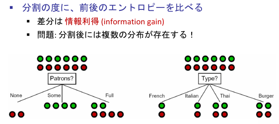

Information gain (entropy loss) by splitting the tree at $at$

$$
I(T, at) = H(T) - H(T, at)
$$

$$
\arg\max_{at}{I(T, at)}
$$

**Why small decision trees are preferred**
- Interpretability
- They tend to dispose of _irrelevant_ and _redundant_ information
- They tend to less overfit
